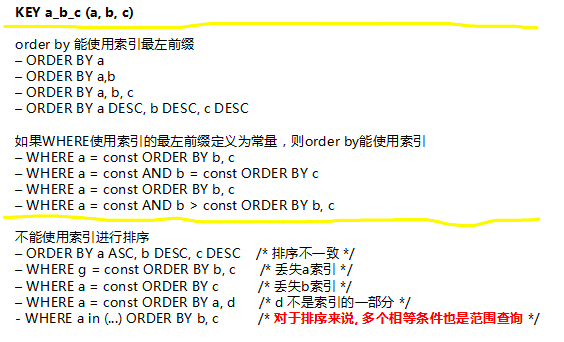

## 什么是索引
索引(Index)是帮助MySQL高效获取数据的数据结构。我们可以简单理解为：快速查找排好序的一种数据结构。
## 索引结构
[B+TEEE](https://www.jianshu.com/p/92d15df75027)

Innodb
- InnoDB是聚集索引，使用B+Tree作为索引结构，数据文件是和（主键）索引绑在一起的（表数据文件本身就是按B+Tree组织的一个索引结构），必须要有主键，通过主键索引效率很高。但是辅助索引需要两次查询，先查询到主键，然后再通过主键查询到数据。
- 主键索引及聚集索引，其他索引为非聚集索引，如果非聚集索引中仅查询索引和id字段，不会触发二次查询，否则会触发二次查询。
## 什么情况下不触发索引
- 索引列参与计算不走索引。where 'a'+1=b， 修改为where 'a'=b-1
- like语句包含查找不走索引。 where name like '%abc%'，模糊查找尽量使用开头匹配， where name like 'abc%'
- 字符串与数字比较不走索引。'a' varchar(10)， where a=1不走索引，改为where a='1'
- 使用NOT IN、<>、!= 操作时不触发索引
- 使用or查询时如果存在非索引的字段，所有查询字段都不会用到索引
- 注意最左前缀原则， 如idx_abc (`a`, `b`, `c`)
   - 查询必须从索引的最左边的列开始，否则无法使用索引。where a=1 and b=2 and c=2使用索引，where b=1 and c=2不使用索引。
   - 不能跳过某一索引列。例如 where a=1 and c=2 不会使用索引。
   - 存储引擎不能使用索引中范围条件右边的列。where a=1 and b like 'a%' and c=2 只会使用到a和b的索引。
   - 
